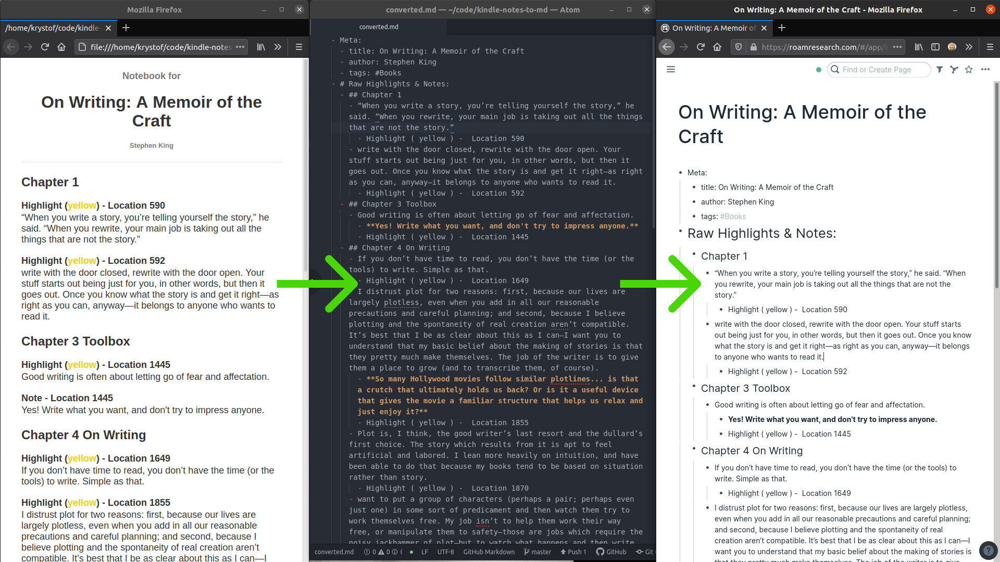

# Kindle Notes to MD

Convert an HTML file of book notes exported from an Amazon Kindle to a Markdown document.

The output format is particularly suitable for copy-pasting into
[Roam Research](https://roamresearch.com):




# Quickstart

Install python packages:

    pip install -r requirements.txt

Convert the example notes:

    kindle_notes_to_md.py example_notebook.html

Optional arguments:

    -nl, --no-location    Do not include the source location of each note/highlight
    -c, --clipboard       Export .md directly to the clipboard instead of file
    -y, --override        Override .md file if one already exists
    -o OUTPUT, --output   A file to which save the Markdown document

You can then open `example_notebook.md` in your favorite text editor.

If you copy-paste the contents of that file into
[Roam Research](https://roamresearch.com), you'll get a nicely organized note as shown in the screenshot above.


## Copying the output directly to the clipboard

You can copy the output directly to your clipboard (so that you can later paste it into your preferred document) using the `-c --clipboard` flag. To make this work, you may need to install a package with a command-line interface to X selections. On Ubuntu, you can accomplish this with

```
sudo apt-get install xclip
```

There are some known issues with this working on Windows Subsystem for Linux (WSL) under Windows 11 which are yet-to-be-investigated.


# How to get your notes in HTML format

I generally read and take notes on my Kindle e-ink reader. When I finish a book, I open the same book on the Kindle app on my phone, go to "My Notebook" for the book (the icon looks like a page with lines), then Export Notebook. This saves the HTML file you can convert.
